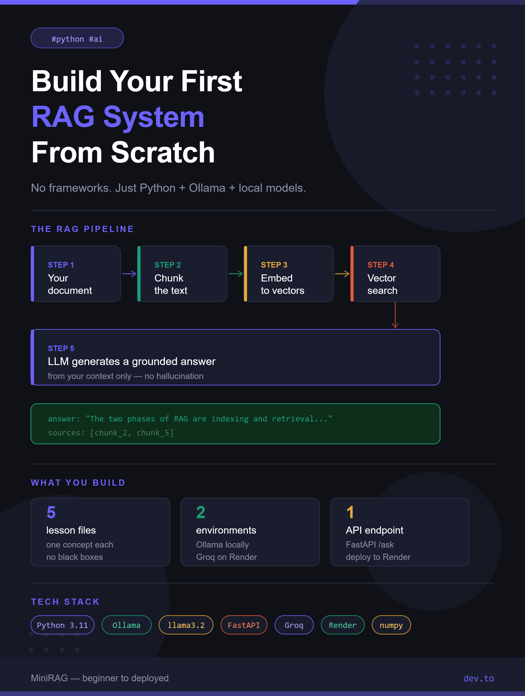

# MiniRAG

A minimal, fully explained Retrieval-Augmented Generation (RAG) system built for learning and teaching.

Every step of the RAG pipeline lives in its own file so you can understand, run, and teach each concept independently before seeing them work together.

---

## What You Will Learn

- How to split documents into chunks
- How to convert text into embeddings (numbers)
- How to search for relevant chunks using vector similarity
- How to build a prompt that grounds an LLM to your document
- How to run the full pipeline locally with Ollama and deploy it with Groq

---

## Project Structure

```
MiniRAG/
├── app.py               # FastAPI web server (entry point for deployment)
├── config.py            # Environment detector (local vs production)
├── document.txt         # The knowledge base the system answers from
├── requirements.txt     # Python dependencies
├── render.yaml          # Render deployment config
│
├── 1_chunking.py        # Lesson 1: split documents into pieces
├── 2_embedding.py       # Lesson 2: convert text to vectors
├── 3_vector_search.py   # Lesson 3: find relevant chunks
├── 4_prompt_builder.py  # Lesson 4: build the RAG prompt
└── 5_rag_pipeline.py    # Lesson 5: full pipeline end to end
```

---

## Requirements

- Python 3.11+
- [Ollama](https://ollama.com) installed and running locally

---

## Local Setup

### 1. Clone the repo

```bash
git clone https://github.com/Navashub/rag-projects.git
cd rag-projects/MiniRAG
```

### 2. Create a virtual environment

```bash
python -m venv venv

# Windows
venv\Scripts\activate

# Mac / Linux
source venv/bin/activate
```

### 3. Install dependencies

```bash
pip install -r requirements.txt
```

### 4. Pull the models into Ollama

```bash
ollama pull nomic-embed-text
ollama pull llama3.2
```

### 5. Start Ollama

Open a separate terminal and keep it running:

```bash
ollama serve
```

### 6. Set up your environment file

```bash
cp .env.example .env
```

Your `.env` should look like this for local development:

```env
MINIRAG_ENV=local
OLLAMA_BASE_URL=http://localhost:11434
EMBED_MODEL=nomic-embed-text
LLM_MODEL=llama3.2
GROQ_API_KEY=
```

---

## Running the Lessons

Each lesson file runs independently. Start from Lesson 1 and work your way up.

### Lesson 1 - Chunking (no API needed)

```bash
python 1_chunking.py
```

You will see the document split into chunks of 100 words with 20-word overlap. Try changing `chunk_size` and `overlap` to see the effect.

### Lesson 2 - Embedding (requires Ollama)

```bash
python 2_embedding.py
```

You will see text converted into vectors and similarity scores between sentence pairs. Notice how similar sentences score close to 1.0 and unrelated sentences score close to 0.0.

### Lesson 3 - Vector Search (requires Ollama)

```bash
python 3_vector_search.py
```

You will see the system embed all chunks, then search for the most relevant ones for each question. Watch the scores — the best matching chunk always comes first.

### Lesson 4 - Prompt Builder (no API needed)

```bash
python 4_prompt_builder.py
```

You will see the full RAG prompt printed clearly. Compare the RAG prompt (with context) vs a plain prompt (without context) and notice the difference.

### Lesson 5 - Full Pipeline (requires Ollama)

```bash
python 5_rag_pipeline.py
```

The full system runs end to end. Four questions are asked — including one that is not in the document. Watch the system say it does not have enough information instead of guessing.

---

## Running the Web Server

```bash
uvicorn app:app --reload
```

Open your browser at:

- `http://localhost:8000` — health check
- `http://localhost:8000/status` — active environment and models
- `http://localhost:8000/docs` — interactive API docs (try questions here)

### Ask a question via curl

```bash
curl -X POST http://localhost:8000/ask \
  -H "Content-Type: application/json" \
  -d "{\"question\": \"What are the two phases of RAG?\"}"
```

---

## Deploying to Render

### 1. Add environment variables on Render dashboard

```
MINIRAG_ENV  = production
GROQ_API_KEY = your_groq_api_key
PYTHON_VERSION = 3.11.9
```

Get a free Groq API key at [console.groq.com](https://console.groq.com).

### 2. Render settings

| Setting | Value |
|---|---|
| Root Directory | `MiniRAG` |
| Build Command | `pip install -r requirements.txt` |
| Start Command | `uvicorn app:app --host 0.0.0.0 --port $PORT` |

### 3. Push to GitHub and Render will deploy automatically

```bash
git add .
git commit -m "deploy MiniRAG"
git push
```

---

## Experiments to Try

Once everything is running, try these to deepen your understanding:

| Experiment | What to change | What you will learn |
|---|---|---|
| Fewer chunks | `chunk_size=200` in Lesson 3 | How chunk size affects retrieval |
| Less context | `top_k=1` in Lesson 5 | How context amount affects answers |
| Off-topic question | Ask about something not in `document.txt` | RAG says it does not know instead of guessing |
| Your own document | Replace `document.txt` with any text file | RAG works on any knowledge base |
| Change the prompt | Edit `4_prompt_builder.py` | How prompt wording changes the answer style |

---

## How the Two Environments Work

| | Local | Production (Render) |
|---|---|---|
| Set by | `MINIRAG_ENV=local` in `.env` | `MINIRAG_ENV=production` on Render |
| Embedding | Ollama (`nomic-embed-text`) | sentence-transformers |
| LLM | Ollama (`llama3.2`) | Groq (`llama3-8b-8192`) |
| API key needed | None | `GROQ_API_KEY` |

---

## Environment Files

| File | Purpose | Commit to GitHub? |
|---|---|---|
| `.env` | Your active config | NO — in `.gitignore` |
| `.env.example` | Template showing structure | YES — no real keys |
| `.env.local` | Local Ollama settings | NO |
| `.env.production` | Render + Groq settings | NO |

---

## Versioning Plan

| Version | What it adds |
|---|---|
| v1 (current) | Core RAG pipeline + FastAPI |
| v2 | Simple web UI (HTML form) |
| v3 | Upload your own documents |
| v4 | Persistent vector store (ChromaDB) |
| v5 | Multiple documents + metadata filtering |

---

## Built With

- [Ollama](https://ollama.com) — local LLM and embedding server
- [Groq](https://groq.com) — fast cloud inference (free tier)
- [FastAPI](https://fastapi.tiangolo.com) — web framework
- [sentence-transformers](https://www.sbert.net) — embeddings on Render
- [llama3.2](https://ollama.com/library/llama3.2) — local language model
- [nomic-embed-text](https://ollama.com/library/nomic-embed-text) — local embedding model